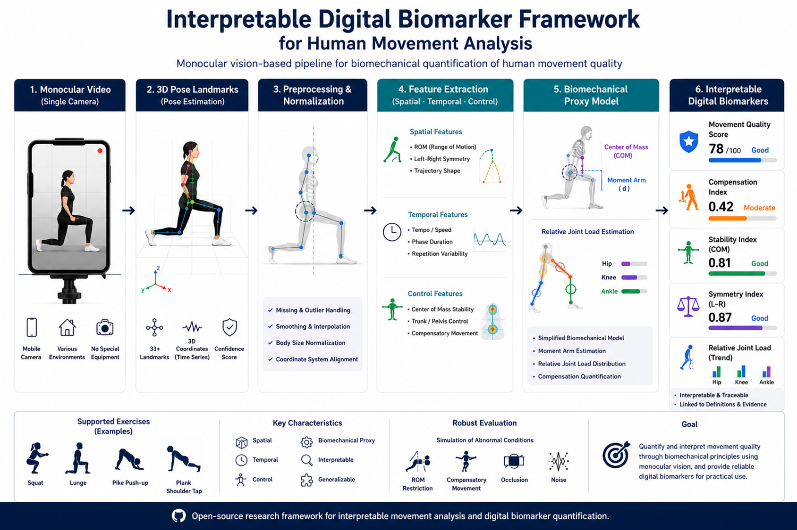

# Movement Project

English | [한국어](README.md)

PhD dissertation research: an analysis framework that quantifies movement quality
from monocular mobile-camera 3D pose data in biomechanical terms and expresses
the result as interpretable digital biomarkers.

Repository: <https://github.com/JonnielPark/movement_project>



*Figure. Conceptual overview of the monocular-vision movement-quality analysis
framework. The six macro-stages summarize the detailed 12-stage pipeline below;
scores and labels on the right are illustrative examples, not validation results.*

---

## Research Framing

This project treats monocular 3D pose as an observation-dependent movement signal,
not as calibrated absolute 3D biomechanics. Camera angle, landmark visibility, and
depth-estimation uncertainty are preserved as analysis provenance and used to
adjust feature confidence instead of forcing every extracted feature into the same
score weight.

The intended biomarker strategy is therefore view-aware and reliability-weighted:
features that are well supported by the selected recording view can contribute
strongly, while depth-sensitive or poorly observed features can be down-weighted,
reported as low confidence, or marked not assessed. In this framing, the filming
angle becomes an analysis-design choice. A frontal view emphasizes frontal
alignment, a side view emphasizes sagittal depth and ROM, and an oblique view
balances both families. Future improvements in monocular pose/depth models,
multi-camera setups, or additional sensors can increase feature reliability and
analysis detail without changing the core biomarker logic.

---

## Pipeline

```text
Pose CSV  +  annotation CSV  +  exercise YAML artifacts
            ↓
①  Validation           structural integrity check
②  Annotation           frame-level segment metadata (`phase` column reserved)
③  Exercise Definition  biomechanical property object loading
④  Preprocessing        monocular data quality correction
⑤  Normalization        body-relative coordinate normalization + optional canonicalization
⑥  Segmentation         semi-automatic rep/phase splitting from joint-motion tracking
⑦  Motion Attribution   per-rep active-side consistency
⑧  Feature Extraction   spatial / temporal / control features, rep and phase level
⑨  Biomech Proxy        CoM, moment arms, load-shift trend
⑩  Biomarker Derivation interpretable digital biomarkers and interpretation rules
⑪  Visualization        per-step visualization and reporting      [partial]
⑫  Simulation           robustness condition injection            [partial]
```

Stage activation is controlled by the `enabled` flags in
`configs/pipeline_default.yaml`.

---

## Implementation Status (2026-05-16)

### Complete

| Area | Module / File | Notes |
|---|---|---|
| Pose I/O and config | `core/io.py`, `core/config.py` | CSV loading, landmark / connection definitions |
| ① Validation | `stages/validation.py` | Structural integrity report |
| ② Annotation | `stages/annotation.py` | Frame-level metadata merge; filming/performance provenance and observed protocol metadata preserved; performance/failure provenance summarized in the annotation report |
| ③ Exercise Definition | `definitions/exercise_definition.py` | `ExerciseContext` loader + validator + generic fallback; split exercise identity / analysis profile / performance protocol / camera protocol YAML; legacy combined YAML remains supported |
| ④ Preprocessing | `stages/preprocessing.py` | Visibility gating, segment consistency, angle bounds, velocity outliers, left-right swap, interpolation, smoothing |
| ⑤ Normalization | `stages/normalization.py`, `stages/canonicalization.py`, `stages/floor_reference.py` | Hip-center translation + median torso-length scale; optional `canonicalization` reduces consistent monocular-observation bias into an analysis coordinate space (raw/norm/canon); current `support_plane_alignment` wraps the existing floor-reference implementation and remains disabled by default |
| ⑥ Segmentation | `stages/segmentation.py` | `rep_segmentation` repetition-boundary detection + existing `phase_segmentation` phase labels; failure-point report |
| ⑦ Motion Attribution | `stages/motion_attribution.py` | Per-rep active-limb consistency; reads `performance_protocol.side_sequence`; conservative / auto-correct modes |
| ⑧ Feature Extraction | `features/` | ROM, symmetry, shape, tempo, variability, CoM stability, compensation rules (`knee_valgus`, `lateral_pelvic_shift`, `excessive_trunk_flexion`, `heel_lift`, `pelvic_rotation`); rep-level + **phase-level** emission; registry coverage, compensation availability, and analysis-disrupting detectability audits; `summarize_phase_to_rep()` |
| ⑨ Biomech Proxy | `biomech/` | CoM range/path, knee/hip moment arms with visibility weighting, **load-shift OLS slope** (`biomech/load_shift.py`, §6.5) |
| ⑩ Biomarker Derivation | `biomarker/` | Z-score deduction, dynamic floor, configurable score bounds/domain weights, **YAML-based interpretation rules** (`biomarker/interpretation.py`, §7.3); movement quality score separated from data confidence |
| Clinical mapping | clinical mapping docs, `data/definitions/clinical/`, `definitions/clinical.py` | §5.5/§5.6 per-exercise feature × biomechanical meaning table + basic FMS-like traffic-light mapping |
| Interpretation rules | `data/definitions/interpretation_rules/` | §7.3 rule engine; four exercises × 5-7 rules; forbidden-vocabulary validation complete |
| Pipeline runner | `pipeline.py` | Currently implemented stages ①-⑩ connected; optional `canonicalization` and `support_plane_alignment` report wired; legacy `floor_relative_correction` kept as a backward-compatible alias |
| Protocol metadata schema | `definitions/exercise_definition.py`, `stages/annotation.py`, `stages/motion_attribution.py`, `pipeline.py`, exercise YAML | CameraProtocol parser/validation, camera-zone warning provenance, protocol count/side-sequence metadata, MediaPipe-style input clarification |
| Pipeline verification baseline | `segmentation.py`, `features/`, reporting records, `tests/` | Verification complete for the current four-exercise scope: phase segmentation, feature registry coverage, compensation availability, analysis-disrupting detectability, source-field policy, and performance/failure provenance |
| Unit tests | `tests/` | Latest full run passes 133/133 |

### Partial

| Area | Module | Remaining Work |
|---|---|---|
| Far-side preprocessing evidence | `stages/preprocessing.py` | Side-view far-side landmark jitter stabilization, feature availability, data-confidence hook (→ Task B) |
| Motion attribution evidence | `stages/motion_attribution.py` | Structured correction log, false-correction metrics, and ambiguous-repetition reporting (→ Task C) |
| Robustness simulation evidence | `simulation/`, `scripts/` | Viewpoint variation, compensation injection, experiment runner, long-format outputs, robustness summaries (→ Task C) |
| ⑪ Visualization | `reporting/visualization.py` | Dissertation-grade static figures: phase segmentation, load shift, robustness sensitivity, attribution heatmap, radar, score breakdown (→ Task D) |

### Plan (Before Defense)

| Task | Deliverable | Dissertation § |
|---|---|---|
| A — Visibility-aware zone reliability completion | Broader zone/role reliability mapping and remaining zone-dependent tests | §6-§8 |
| B — Structured motion-attribution correction log | Correction log, false-correction metrics, ambiguous-repetition reporting | §8 |
| C — Robustness simulation and experiment runner | Viewpoint/compensation simulation injectors, `scripts/run_robustness_experiment.py`, long-format outputs, robustness summaries | §8 |
| D — Dissertation-grade reporting visualization | Six static figure functions, `save_figure()`, source-field/caption provenance, `outputs/figures/` exports | §11 |
| E — Clinical mapping integration and dashboard gate | FMS-like mapping coverage check, feature availability linkage, optional traffic-light/severity integration into reporting; dashboard decision gate | §7.4 |
| F — Maintenance and repository hygiene | Focused test runs, full `python -m pytest` before handoff, cache/build cleanup, stable README development commands | Development hygiene |
| G — Optional visibility-aware scoring fallback | Feature availability policy and confidence notes if occlusion, left/right swap, or landmark jitter persist after preprocessing | Conditional after motion-attribution, robustness, and reporting |
| H — Deferred canonicalization promotion gate | Keep `canon` review-only unless notebook and robustness evidence justify downstream promotion | Conditional / deferred |

Dashboard / Phantom 3D work is deferred behind the Task E gate and is not an active
implementation task unless selected as a dissertation output.

---

## Project Structure

```text
movement_project/
├── configs/
│   └── pipeline_default.yaml        # stage toggles + all runtime parameters
├── data/
│   ├── pose/                        # joint-point time-series CSVs
│   │   ├── sample/                  # synthetic/demo CSVs
│   │   └── mediapipe/               # MediaPipe-extracted CSVs
│   ├── definitions/                 # YAML-based analysis definitions
│   │   ├── exercises/               # exercise identity YAML + generic fallback
│   │   ├── analysis_profiles/       # segmentation, landmarks, features, quality rules
│   │   ├── clinical/                # feature_meanings.yaml, fms_mapping.yaml
│   │   └── interpretation_rules/    # squat/lunge/pike_pushup/plank_shoulder_tap .yaml
│   ├── protocols/
│   │   ├── performance/             # participant-facing count/sequence protocol YAML
│   │   └── camera/                  # per-exercise camera protocol YAML
│   ├── registries/                  # authoring dropdown/template registries
│   ├── camera/                      # camera_zones.yaml filming-zone definitions
│   ├── reference/                   # baseline_zscore.json (synthetic-normal baseline)
│   └── processed/                   # intermediate/final pipeline outputs by stage (.gitignore)
├── docs/
│   ├── assets/                       # Shared figures for README and documents
│   ├── terminology.md               # study-specific terms and clinical language principles
│   ├── overview.md                  # framework overview
│   ├── practical_protocols/         # practical filming and performance protocols
│   │   ├── camera_protocol.md
│   │   ├── exercise_performance_protocol.md
│   │   └── exercise_authoring_notebook.md
│   ├── pipeline/                    # pipeline stage documents ① ~ ⑫
│   │   └── 00_data_format.md ~ 12_insilico_simulation.md
│   ├── clinical/
│   │   └── per_exercise_mapping.md  # §5.5/§5.6 feature × clinical meaning
├── notebook/                        # exploratory notebooks (00-16)
├── scripts/                         # one-off utilities such as baseline computation
├── tests/
│   ├── test_biomech_load_shift.py   # ⑨ load-shift slope sign + guards (17 cases)
│   └── test_interpretation.py       # ⑩ rule loader + 3 scenarios (20 cases)
└── src/movement/
    ├── biomech/
    │   ├── __init__.py              # BiomechRecord · extract_rep_biomech()
    │   ├── anthropometry.py
    │   ├── com.py
    │   ├── load_shift.py            # §6.5 within-set load transfer OLS
    │   └── moment_arm.py
    ├── biomarker/
    │   ├── __init__.py
    │   ├── interpretation.py        # §7.3 YAML rule engine → InterpretationRecord
    │   └── scoring.py               # BiomarkerScoreRecord · Z-score · dynamic floor
    ├── core/
    │   ├── config.py                # LANDMARKS, CONNECTIONS, column helpers
    │   ├── io.py                    # pose CSV loading
    │   └── utils.py                 # low-level pose/plot utilities
    ├── definitions/
    │   ├── clinical.py              # FMS-like mapping helpers
    │   ├── exercise_authoring.py    # notebook-first exercise YAML draft generator
    │   └── exercise_definition.py   # ExerciseContext loader + schema dataclasses
    ├── features/
    │   ├── __init__.py              # extract_rep_features() · FeatureRecord
    │   ├── compensation.py          # COMPENSATION_RULES registry
    │   ├── control.py
    │   ├── spatial.py
    │   └── temporal.py
    ├── pipeline.py
    ├── reporting/
    │   └── visualization.py
    ├── simulation/
    └── stages/
        ├── annotation.py
        ├── floor_reference.py
        ├── motion_attribution.py
        ├── normalization.py
        ├── preprocessing.py
        ├── segmentation.py
        └── validation.py
```

Existing public import paths such as `movement.io`, `movement.validation`, and
`movement.normalization` remain available as compatibility aliases. New
implementation files should prefer the internal folder structure above.

---

## Installation

Python 3.10 or newer is required. Python 3.11 or 3.12 is recommended for local
research and development.

```bash
git clone https://github.com/JonnielPark/movement_project.git
cd movement_project
python -m pip install -e .
# Development dependency group (pytest)
python -m pip install -e ".[dev]"
```

---

## Quick Start

```python
from movement.io import load_pose_csv
from movement.pipeline import load_pipeline_config, run_pipeline
import pandas as pd

config = load_pipeline_config("configs/pipeline_default.yaml")
df     = load_pose_csv("data/pose/sample/mediapipe_squat_synthetic.csv")
ann_df = pd.read_csv("data/pose/sample/mediapipe_squat_synthetic_annotation.csv")

df, report = run_pipeline(df, config, ann_df=ann_df)
```

Getting interpretation labels after running the pipeline:

```python
from movement.biomarker.interpretation import derive_interpretations

# score_records: list[BiomarkerScoreRecord] returned by run_pipeline / derive_biomarkers
for score in score_records:
    for interp in derive_interpretations(score, biomech_records=biomech_records):
        print(f"[rep {score.rep_id}] {interp.rule_id}: {interp.label}")
```

---

## Tests

```bash
python -m pytest -q
```

---

## Data Format

Input CSV — required columns:

```text
frame          integer frame index (monotonic increasing)
timestamp      seconds elapsed from start
<landmark>_x   float
<landmark>_y   float
<landmark>_z   float
<landmark>_visibility  float 0-1  (recommended)
```

The full column specification and detailed document index are tracked in
[docs_eng/overview.md](docs_eng/overview.md).

---

## Documentation

README tracks only the top-level documents. The list and versions of documents
inside `practical_protocols/`, `pipeline/`, and `clinical/` are tracked in the document index in
[docs_eng/overview.md](docs_eng/overview.md).

| Version | File | Content |
|---|---|---|
| 1.4.7 | [docs_eng/terminology.md](docs_eng/terminology.md) | Study-specific terms and clinical language principles |
| 1.4.31 | [docs_eng/overview.md](docs_eng/overview.md) | Framework overview and detailed document index |
| 1.2.7 | [docs_eng/practical_protocols/camera_protocol.md](docs_eng/practical_protocols/camera_protocol.md) | Camera filming protocol per exercise |
| 1.0.8 | [docs_eng/practical_protocols/exercise_performance_protocol.md](docs_eng/practical_protocols/exercise_performance_protocol.md) | Exercise performance protocol per exercise |
| 1.0.3 | [docs_eng/clinical/exercises/README.md](docs_eng/clinical/exercises/README.md) | Per-exercise clinical rationale documents |

---

## Data Policy

This project does not analyze videos directly. It analyzes only **joint-point
time series (CSV)** extracted from videos.

**Can be committed.**

- `data/pose/sample/` — synthetic/demo joint-point CSVs generated by code
- `data/pose/mediapipe/` — joint-point CSVs extracted with MediaPipe
- `data/definitions/` — exercise definitions, interpretation rules, clinical mapping YAML
- `data/camera/` — shared YAML for filming zones and height levels
- `data/reference/` — reference statistics such as the synthetic-normal baseline

**Do not commit (`.gitignore`).**

- Pipeline outputs — `data/processed/`

**Caution.** If a committable CSV contains direct identifiers such as subject
name or birth date, replace them with anonymous IDs before committing. Store the
anonymous ID ↔ real-name mapping only after documenting the sidecar path and
matching `.gitignore` rule.

---

## Research Scope

This project does **not** aim to perform **absolute quantification of joint
load** that requires high-cost biomechanical equipment (absolute quantification;
e.g., `N`, `N·m`, `kg`).

It also does **not** directly determine muscle-specific activation or
target-muscle recruitment. Because small changes in joint angle, stance, load,
speed, and anatomy can change muscle recruitment, this pipeline interprets active
side, relative load shift, moment-arm proxy, and compensatory movement as
joint-/segment-level tendencies rather than direct evidence of activation in a
specific muscle.

Instead, it focuses on quantifying **relative load shift between body segments**
and **kinetic-chain breakdown patterns** that can be tracked broadly in
monocular-vision remote monitoring settings, in order to verify the system's
**engineering feasibility and robustness**.

Therefore, all biomechanical proxy metrics in this pipeline are designed and
produced as body-scale-normalized relative values or angle-based metrics, not
absolute force, mass, or length units (e.g., `torso_length_ratio`, `degree`,
`dimensionless_cv`, `dimensionless`).

The current target exercises are limited to structured in-place bodyweight
exercises. Extending the framework to equipment-based exercises or highly dynamic
and spatially traveling movements such as jumping, running, or change-of-direction
tasks would require additional components, including equipment position, external
load metadata, hand-equipment contact, ground-contact events, flight phases,
global travel paths, more complex event segmentation, and expanded camera protocols.

This prioritizes a reliable XAI structure that can consistently support
clinical reasoning under the physical limitations of monocular-camera data,
before any direct demonstration of clinical efficacy.

---

## License

TBD.
