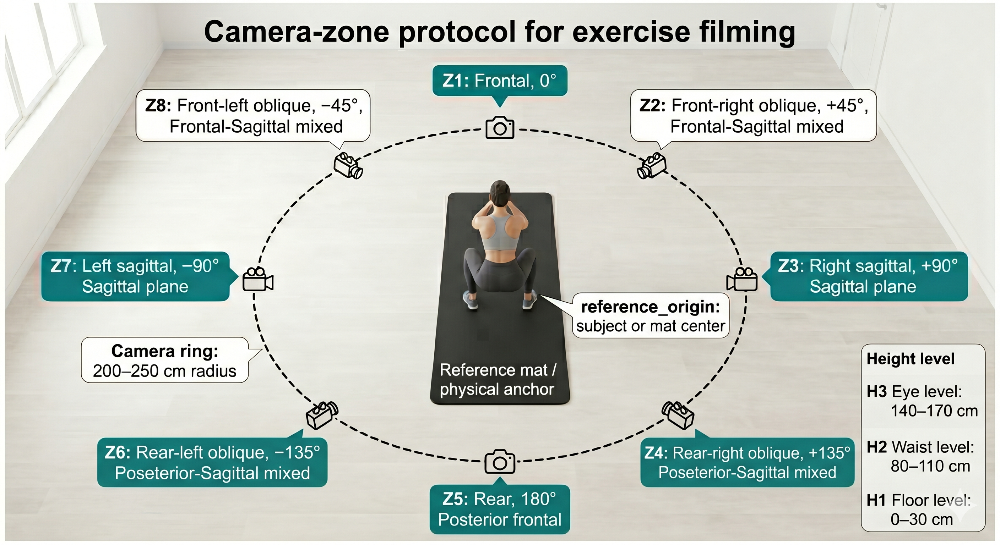

# 대상 운동별 촬영 프로토콜 (Camera Filming Protocol per Exercise)

**문서 버전:** 1.3.0
**최종 갱신:** 2026-05-12
**영문 동기화:** [docs_eng/practical_protocols/camera_protocol.md](../../docs_eng/practical_protocols/camera_protocol.md)는 동일 내용의 영문 번역본이다.

본 문서는 단안 비전(monocular vision) 환경에서 포즈 데이터 왜곡을 줄이고, 반복 가능한
분석 조건을 확보하기 위한 데이터 취득 가이드이다. 사용자의 일상 환경을 고려해 인위적
통제는 최소화하되, 운동별 핵심 보상 움직임을 관찰하기 위한 최소 촬영 조건을 정의한다.

이 프로토콜은 좌표 보정 알고리즘이 아니다. 권장 촬영 구역을 벗어난 데이터도 파이프라인에서
강제로 거부하지 않으며, 촬영 조건은 provenance와 경고 정보로 남긴다.

---

## 1. 촬영 구역 매트릭스 (Camera Zone Matrix)

피험자 또는 기준 매트 중심은 촬영 Zone이 아니라 `reference_origin`으로 정의한다. 카메라는
이 origin을 둘러싼 원형 촬영 링(circular filming ring) 위에 두며, 기본 권장 거리는 반경
200-250 cm이다. 촬영 위치는 방위각(azimuth), 링 위의 거리, 높이(height level)를 조합해
표현한다.

Zone은 거리 차이가 아니라 관찰 방향 차이를 의미한다. 모든 Zone은 동일하게 반경
200-250 cm를 권장하며, 방위각 허용 범위는 약 ±10도로 둔다.
도식에서는 `Z1`을 위쪽에 두고 양(+)의 방위각이 시계 방향으로 증가한다고 본다.
따라서 `Z4`는 링의 우하단, `Z6`는 좌하단에 놓인다.



*그림 1. Camera zone은 `reference_origin`을 중심으로 한 동일 반경 200-250 cm
촬영 링의 방위각 구역으로 정의하며, 높이 레벨은 별도 메타데이터로 기록한다.*

| Zone | 방위각/위치 | 주 관찰 평면 | 링 위 위치 |
|---|---|---|---|
| Z1 | 정면, 0도 | 관상면 | 반경 200-250 cm, ±10도 |
| Z2 | 전면 우측 대각선, +45도 | 관상면 + 시상면 혼합 | 반경 200-250 cm, ±10도 |
| Z3 | 우측면, +90도 | 시상면 | 반경 200-250 cm, ±10도 |
| Z4 | 후면 우측 대각선, +135도 | 후면 관상면 + 시상면 혼합 | 반경 200-250 cm, ±10도 |
| Z5 | 후면, 180도 | 후면 관상면 | 반경 200-250 cm, ±10도 |
| Z6 | 후면 좌측 대각선, -135도 | 후면 관상면 + 시상면 혼합 | 반경 200-250 cm, ±10도 |
| Z7 | 좌측면, -90도 | 시상면 | 반경 200-250 cm, ±10도 |
| Z8 | 전면 좌측 대각선, -45도 | 관상면 + 시상면 혼합 | 반경 200-250 cm, ±10도 |

높이는 다음 세 단계로 기록한다.

| Height | 높이 | 용도 |
|---|---|---|
| H1 | 지면으로부터 0-30 cm | 플랭크, 파이크 푸쉬업 등 지면 밀착형 운동 |
| H2 | 지면으로부터 80-110 cm | 스쿼트, 런지 등 하체 운동 |
| H3 | 지면으로부터 140-170 cm | 전신 또는 상체 중심 운동 |

height metadata를 선택 canonicalization prior에서 사용할 때, height level은 calibrated camera
model이 아니라 신체 기준 anchor 선택에만 사용한다.

| Height | 프로토콜 높이가 일치할 때의 canonicalization anchor | 이유 |
|---|---|---|
| H1 | 지지/발목 높이 anchor | 낮은 카메라 위치는 floor-based 또는 낮은 자세 운동의 지지 접점 높이에 가장 가깝다. |
| H2 | 골반 / hip-center anchor | 스쿼트와 런지는 카메라가 하체 중심 높이에 오도록 설계되므로, 골반이 가장 보수적인 좌우폭 기준이다. |
| H3 | shoulder-center / shoulder-line anchor | 상체 또는 전신 상부 관찰에서는 어깨선 기하가 중앙 관찰 높이에 가장 가깝다. |

관찰 height가 unknown이거나 권장 height와 맞지 않는 경우에는, 연구자가 검토 과정에서 명시적으로
override하지 않는 한 이 anchor 선택을 보정에 사용하지 않는다.

---

## 2. 기준 매트 기반 물리적 앵커 (Reference-Mat Physical Anchor)

별도 캘리브레이션 도구 없이 사용자가 거리와 방향을 맞출 수 있도록 기준 매트(reference mat)를
물리적 앵커로 사용한다. 표준 기준 매트 크기는 대략 180 cm × 60 cm로 간주한다.

이 매트는 영상에서 자동 검출하거나 카메라를 보정하기 위한 calibration target이 아니다.
파이프라인은 매트의 모서리, 크기, 투시 변환을 추정하지 않으며, 기준 매트 정보는 촬영자가
위치를 맞추고 `reference_mat_used`와 촬영 조건 경고를 기록하기 위한 운영 메타데이터로만
사용한다.

| 항목 | Zone | 가이드 |
|---|---|---|
| 거리 | 전체 Zone | 스마트폰 화면에 기준 매트 전체가 들어오도록 약 3걸음, 즉 200-250 cm 뒤로 이동한다. |
| 정면 촬영 | `Z1` | 기준 매트의 전방 중심선 위에 카메라를 두고 `reference_origin`을 향하게 한다. 화면에서 매트의 좌우가 대략 대칭으로 보이도록 맞춘다. 현재 또는 추후 정면 관상면 추적이 중요한 운동을 위한 선택지이다. |
| 후면 촬영 | `Z5` | 기준 매트의 후방 중심선 위에 카메라를 두고 `reference_origin`을 향하게 한다. 같은 origin을 유지하면서 추후 후면 운동이나 후면 보상 패턴을 촬영하기 위한 선택지이다. |
| 전방 대각 촬영 | `Z2` / `Z8` | 기준 매트의 전방에서 약 45도 대각선 위치에 카메라를 두고, 가까운 앞쪽 모서리 또는 `reference_origin`을 향하게 한다. 관상면과 시상면 정보를 함께 보는 혼합 관찰에 사용한다. |
| 후방 대각 촬영 | `Z4` / `Z6` | 기준 매트의 후방에서 약 45도 대각선 위치에 카메라를 두고, 가까운 뒤쪽 모서리 또는 `reference_origin`을 향하게 한다. 추후 후면-시상면 혼합 관찰이 필요한 운동을 위한 선택지이다. |
| 측면 촬영 | `Z3` / `Z7` | 기준 매트의 긴 변이 화면 중심축과 평행하도록 맞추고 `reference_origin`을 향하게 한다. 시상면 관찰에 사용한다. |

기준 매트가 없거나 권장 거리에서 촬영하지 못한 경우에도 데이터는 수용한다. 단, 해당 조건은
촬영 메타데이터와 결과 리포트에 경고로 남긴다.

---

## 3. 대상 운동별 권장 세팅 (Per-Exercise Recommended Settings)

| 대상 운동 | 권장 Zone | 권장 높이 | 관찰 목적 |
|---|---|---|---|
| 스쿼트 | Z2 / Z8 | H2 | 전방 대각 시점에서 무릎 외반(valgus)과 고관절 굴곡 깊이를 함께 관찰 |
| 런지 | Z3 / Z7 | H2 | 무릎 전방 이동과 체간/하지 시상면 정렬 관찰 |
| 파이크 푸쉬업 | Z3 / Z7 | H1 | 어깨 각도와 힙 힌지 구조 변화 관찰 |
| 플랭크 숄더탭 | Z2 / Z8 | H1 | 체중 이동 중 골반 회전과 측방 흔들림 관찰 |

권장 구역은 가장 적합한 관찰 조건을 의미한다. 실제 파이프라인은 권장 구역 밖의 데이터도
처리하되, 해석 시 촬영 조건으로 인한 신뢰도 저하 가능성을 함께 표시한다.

---

## 4. 시점 의존 지표 신뢰도 (View-Dependent Metric Reliability)

권장 camera zone은 통과/탈락을 나누는 이분법 기준이 아니다. 각 지표군에 대한 reliability prior다.
같은 영상이라도 어떤 지표는 잘 관찰하고, 다른 지표는 low-confidence가 될 수 있다. 따라서
시스템은 다음을 분리해야 한다.

```text
metric_computed        수치 피처를 계산할 수 있는지
view_reliability       해당 촬영 view가 그 해석을 뒷받침하는지
feature_availability   visibility, 기하 plausibility, swap risk, view reliability가
                       scoring 사용을 허용하는지
```

신뢰도 수준은 다음처럼 해석한다.

| 수준 | 의미 | 기본 점수화 사용 |
|---|---|---|
| high | 해당 view가 지표군을 직접 뒷받침한다. | landmark 품질이 충분하면 scoring 후보. |
| moderate | 해석 가능한 view지만 알려진 tradeoff가 있다. | confidence/provenance note와 함께 scoring 후보. |
| low | 계산은 가능할 수 있으나 view 한계가 크다. | 더 강한 근거가 없으면 report/review 전용. |
| not_assessed | 해당 view가 의미 있는 판독을 뒷받침하지 않는다. | 점수화하지 않는다. |

### 4.1 양측 대칭 운동

스쿼트 같은 양측 대칭 운동에서 좌우 symmetry와 관상면 정렬은 카메라가 관상면을 직접 관찰하는지에
크게 의존한다. 반대로 시상면 ROM과 하강 깊이는 측면/시상면 관찰에 크게 의존한다. 하나의 영상에서
두 지표군을 함께 검토해야 할 때 전방 대각 view를 권장한다.

| Zone 계열 | 대표 zone | 신뢰도 높은 지표군 | 신뢰도 낮은 지표군 |
|---|---|---|---|
| 정면 | Z1, Z5 | 좌우 symmetry, 관상면 무릎 tracking, 골반 측방 이동, 어깨/골반선 기울기 | 시상면 ROM, 하강 깊이, 체간 굴곡, heel lift |
| 전방 대각 | Z2, Z8 | symmetry + depth 혼합 검토, 무릎 tracking, hip-center 안정성 | 순수 시상면 또는 순수 관상면의 정밀 해석 |
| 측면 | Z3, Z7 | 하강 깊이, hip/knee/ankle 시상면 ROM, 체간 기울기, heel lift, tempo/smoothness | 좌우 symmetry, knee valgus/varus, 골반 측방 이동 |
| 후방 대각 | Z4, Z6 | 필요한 경우 후방 관상면 정렬과 일부 시상면 맥락 | 전방 무릎 tracking, 전면 landmark 해석 |

따라서 스쿼트에서 Z2/Z8을 권장하는 이유는 이 시점이 완벽해서가 아니라, 단일 view 안에서 무릎
tracking, 하강 깊이, 전반적 양측 협응을 가장 균형 있게 관찰하기 때문이다. 스쿼트를 Z3/Z7에서
촬영한 경우 시상면 지표는 high-confidence로 남을 수 있지만 symmetry는 low-confidence 또는
not assessed가 될 수 있다. 반대로 Z1에서 촬영한 경우 관상면 정렬은 high-confidence일 수 있지만
하강 깊이, 시상면 ROM, 체간 굴곡, heel lift는 낮은 confidence로 처리한다.

### 4.2 편측 또는 교대 운동

편측 또는 교대 운동에서는 anatomical left/right만을 비교 축으로 삼지 않는다. 우선하는 해석은
역할 기반이다.

```text
forward_leg / trailing_leg       런지와 split-stance 과제
active_side / support_side       교대 또는 편측 과제
near_side / far_side             카메라 기준 관측 신뢰도 맥락
```

런지 같은 측면 편측 과제에서는 보통 시상면의 역할별 역학을 관상면 보상보다 더 잘 관찰한다.
하지만 좌우를 전환할 때 forward limb 또는 active limb가 near-side와 far-side 사이를 바꿀 수
있다. 따라서 side-to-side 비교는 active-side provenance와 near/far-side reliability가 함께
기록된 경우에만 scoring 후보가 된다.

| Zone 계열 | 대표 zone | 신뢰도 높은 지표군 | 신뢰도 낮은 지표군 |
|---|---|---|---|
| 정면 | Z1, Z5 | 좌우 순서, step width, lateral trunk lean, pelvis drop/shift, 관상면 무릎 정렬 | 무릎 전방 이동, rear-hip extension, 시상면 체간 기울기, 하강 깊이 |
| 전방 대각 | Z2, Z8 | active-side attribution, 일부 관상면 정렬, 일부 시상면 ROM의 혼합 검토 | 정밀한 rear-limb 시상면 ROM 또는 순수 관상면 보상 |
| 측면 | Z3, Z7 | 무릎 전방 이동, 앞/뒤 다리 시상면 ROM, rear-hip extension, 체간 기울기, 보폭 | knee valgus/varus, pelvis drop, lateral trunk lean, 좌우 symmetry |
| 후방 대각 | Z4, Z6 | 후방 지지 정렬과 일부 시상면 맥락 | 전방 무릎 tracking, active limb 관상면 세부 해석 |

따라서 측면 런지는 forward-leg 무릎 전방 이동과 체간 정렬에 대해 high-confidence일 수 있지만,
관상면 knee valgus에는 low-confidence가 될 수 있다. 정면 런지는 step width와 pelvis drop에
대해 high-confidence일 수 있지만, rear-hip extension이나 무릎 전방 이동에는 낮은 confidence가
붙는다. 이는 자동 감점이 아니라 view-dependent confidence 상태다.

---

## 5. 원테이크 및 세션 관리 (One-Take Session Protocol)

1. 각 세트는 녹화 시작 후 별도의 정적 대기 시간 없이 10회를 연속 수행한다.
2. 여러 세트를 촬영할 때는 세트별 파일로 분리하되, `session_id`와 `set_index`로 하나의
   시계열 세션에 속한다는 정보를 보존한다.
3. 인위적인 T-pose 캘리브레이션은 요구하지 않는다. 정규화 단계는 기존 원칙대로 전체
   시퀀스의 몸통 길이 중앙값과 매 프레임 골반 중심점을 사용한다.

10회 연속 수행은 후반 반복에서 나타나는 피로 관련 보상 움직임을 관찰하기 위한 취득
전략이다. 이 자체가 피로를 진단한다는 의미는 아니며, 파이프라인은 반복 간 변화 추세를
정량화하는 데 사용한다.

---

## 6. 파이프라인 반영 방식 (Pipeline Usage)

촬영 프로토콜은 다음 위치에서 메타데이터로 사용한다.

```text
data/camera/camera_zones.yaml
    Z1-Z8 polar-ring 구역, reference_origin, H1-H3 높이, anchor, out_of_zone 정책의 공통 정의

data/definitions/exercises/<exercise_id>.yaml
    camera_protocol 블록에 운동별 권장 zone, height, 관찰 목적, 계획된
    view_metric_reliability map 기록

Annotation 또는 recording metadata
    session_id, recording_id, set_index, camera_zone, camera_height_level,
    reference_mat_used, filming_protocol_status 등 선택 칼럼 기록
```

처리 정책:

```text
권장 구역 일치          provenance로 기록하고 정상 처리
권장 구역 불일치        경고를 남기고 정상 처리
촬영 구역 미기록        unknown으로 기록하고 정상 처리
기준 매트 미사용         경고를 남기되 강제 제외하지 않음
기준 매트 자동 검출      수행하지 않음
매트 기반 캘리브레이션   수행하지 않음
calibrated 카메라 각도 보정 수행하지 않음
좌표 재투영 보정         수행하지 않음
pose 내부 바닥 기준 보정  ⑤ 정규화 내부 선택 필터에서 별도 처리; 캘리브레이션으로 해석하지 않음
height-aware lateral-width canonicalization ⑤ 정규화 내부 선택 prior; 렌즈 보정으로 해석하지 않음
측면 view depth-derived symmetry      feature availability gate 통과 전에는 점수화하지 않음
view-metric reliability map           confidence/provenance로 사용, 좌표 보정으로 사용하지 않음
```

⑤ 정규화 내부의 바닥 기준 필터는 본 촬영 프로토콜의 camera-angle correction이 아니다. 실제 카메라
intrinsic/extrinsic을 추정하거나 좌표를 물리적 공간으로 재투영하지 않고, 정규화된 pose 좌표계
안에서 support-contact landmark 기반 pseudo-floor reference를 추정하는 artifact 완화 단계다.
기본값은 수평 카메라 target(`camera_pitch_deg=0.0`, `camera_roll_deg=0.0`)으로 두지만,
필요하면 pose 좌표계 안에서 보존할 pseudo-floor 기울기를 이 파라미터로 조정할 수 있다.
현재 검토 transform은 support-contact 높이만 바꾸는 것이 아니라 pose 좌표 집합을 함께
회전시키는 `rigid_rotation`이다. 이는 어디까지나 pose 내부 prior이며 카메라
캘리브레이션이 아니다.
자세한 정책은 [05_normalization.md](../pipeline/05_normalization.md)를
따른다.

⑤ 정규화 내부의 선택적 프로토콜 높이 기반 좌우폭 prior는 `camera_height_level`과 운동별
`recommended_height`를 gate로 사용할 수 있다. 높이가 일치하면 H1/H2/H3별 신체 anchor를
선택하고, review-only `canon` 좌표에서 depth-dependent lateral-width bias를 보수적으로 완화한다.
현재 스쿼트 프로토콜에서는 H2가 골반 / hip-center anchor로 매핑된다. 이 prior는 렌즈 왜곡을
모델링하거나 camera intrinsic을 추정하지 않으며, low-confidence far-side landmark를 실제 위치라고
단정해 확장하지 않는다.

측면 또는 측면에 가까운 촬영에서 단안 3D pose를 정면으로 돌려보는 것은 실제 정면 관찰을
만드는 것이 아니다. 해당 렌더링에서 좌우 균형이 크게 무너져 보이더라도, 실제 정면 또는 전방
대각 촬영이 같은 패턴을 뒷받침하기 전까지는 depth inference confidence 문제로 처리한다.
따라서 bilateral symmetry feature는 visibility, 분절 기하 plausibility, 좌우 swap 위험,
좌우 해석을 뒷받침하는 view 조건을 확인하는 feature-availability gate를 통과할 때만 점수화
후보가 된다.

시점(viewpoint) 변화가 지표에 미치는 영향은 ⑫ Simulation에서 강건성 조건으로 평가한다.
⑪ Visualization은 촬영 조건 경고를 결과 해석 옆에 표시할 수 있다.

관련 문서:

- [exercise_performance_protocol.md](exercise_performance_protocol.md)
- [02_annotation.md](../pipeline/02_annotation.md)
- [03_exercise_definition.md](../pipeline/03_exercise_definition.md)
- [12_insilico_simulation.md](../pipeline/12_insilico_simulation.md)
