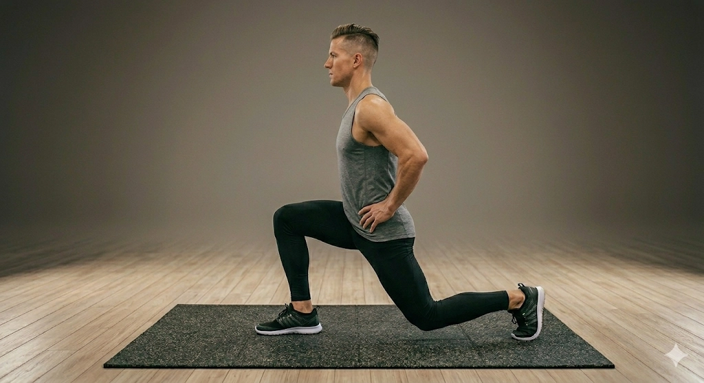

# 대상 운동별 수행 프로토콜 (Exercise Performance Protocol per Exercise)

**문서 버전:** 1.0.3
**최종 갱신:** 2026-05-08
**영문 동기화:** [docs_eng/practical_protocols/exercise_performance_protocol.md](../../docs_eng/practical_protocols/exercise_performance_protocol.md)는 동일 내용의 영문 번역본이다.

본 문서는 4대 대상 운동의 표준 수행 지시, 피험자 안내 문구, 그리고 분석을 방해하는 수행
패턴을 정리한다. 여기서 "올바른 수행"은 임상적 교정 기준이 아니라, 단안 비전 포즈 분석에서
의도한 관절 움직임과 보상 후보를 일관되게 관찰하기 위한 데이터 취득 기준이다.

카메라 위치와 높이의 공통 정의는 [camera_protocol.md](camera_protocol.md)를 따른다.

---

## 1. 공통 원칙 (Common Principles)

1. 각 세트는 가능하면 원테이크로 촬영하며, 시작 후 별도의 정적 대기 시간 없이 수행한다.
2. 파일럿 파이프라인 검증용 데이터의 기본 취득 단위는 하루 1가지 운동, 운동별 3세트,
   세트당 10회이다. 가능하면 각 세트는 별도 녹화 파일로 저장한다.
3. 세트 사이에는 호흡이 평상시에 가깝게 안정될 때까지 약 2-3분 휴식한다. 같은 날 2가지
   이상의 운동을 촬영해야 한다면, 운동 종류 사이에는 최소 15-20분 이상 충분히 휴식한다.
4. 주요 관절이 잘 검출되도록 운동복을 착용한다. 무릎, 골반, 어깨, 몸통 랜드마크를 가릴 수
   있는 매우 헐렁한 상의나 통이 넓은 바지는 피한다.
5. 포즈 추정기가 대상자를 혼동하지 않도록 거울 반사가 없고 다른 사람이 프레임 안으로
   들어오지 않는 독립된 공간에서 촬영한다.
6. 세트 후반에 자세가 무너지더라도 카메라를 의식해 인위적으로 깔끔한 반복을 연기하지
   않는다. 통증이 없는 범위에서 자연스럽게 수행하되, 통증이나 부상 위험이 느껴지면 즉시
   중단한다.
7. 목표 반복 수는 10회이다. 10회를 채우기 어려운 운동은 자세가 완전히 무너지기 전의 최대
   반복 수를 기록하고, 실제 반복 수를 annotation 또는 recording metadata에 남긴다.
8. 팔 움직임이 분석 대상이 아닌 운동에서는 양손을 고정하여 팔 반동이 관절 궤적에 섞이지
   않도록 한다.
9. 아래의 "분석을 방해하는 수행 패턴"은 자동 제외 규칙이 아니다. 데이터 품질 경고,
   annotation note, synthetic distortion 설계, 또는 추후 YAML 기반 품질 규칙의 후보로
   사용한다.

---

## 2. 운동별 프로토콜 (Per-Exercise Protocols)

### 2-1. 스쿼트 (Squat)


*그림 2-1. 피험자가 동작을 이해하기 위한 스쿼트 수행 예시 이미지.*

**카메라 세팅**

```text
Zone: Z2 / Z8
Height: H2
```

기준 매트 기준 전방 대각 위치인 `Z2` 또는 `Z8`에 카메라를 둔다. 렌즈 높이는
골반 또는 배꼽 높이인 약 80-110 cm로 맞춘다.

**측정 이유**

무릎의 관상면 정렬 변화와 고관절 굴곡 깊이를 동시에 관찰하기 위한 조건이다.

**피험자 안내 문구**

1. 발을 어깨너비로 벌리고 선다. 양손은 가슴 앞에 X자로 교차하거나 가볍게 모아, 팔의 반동을
   사용하지 않도록 고정한다.
2. 의자에 앉듯 엉덩이를 뒤로 빼며 허벅지가 바닥과 거의 평행해질 때까지 내려간 뒤 일어선다.
3. 쉬지 않고 연속 10회를 수행한다.

**분석을 방해하는 수행 패턴**

- 팔을 크게 흔들어 상승 동작에 반동을 주는 경우
- 발뒤꿈치가 반복적으로 들리거나 발 위치가 매 반복 크게 바뀌는 경우
- 무릎이 발 진행 방향 대비 과도하게 안쪽 또는 바깥쪽으로 벗어나는 경우
- 하강 깊이가 반복마다 크게 달라져 ROM 기준점이 불안정한 경우
- 체간을 과도하게 접어 고관절 굴곡과 체간 굴곡이 분리되지 않는 경우

**개발 활용 메모**

`compensation_candidates`의 `knee_valgus`, `knee_varus`, `asymmetric_depth`,
`excessive_trunk_flexion`, `heel_lift`, `tempo_instability`와 연결될 수 있다.

### 2-2. 런지 (Lunge)



*그림 2-2. 피험자가 동작을 이해하기 위한 런지 수행 예시 이미지.*

**카메라 세팅**

```text
Zone: Z3 / Z7
Height: H2
```

기준 매트 기준 측면 위치인 `Z3` 또는 `Z7`에 카메라를 둔다. 렌즈 높이는
골반 높이인 약 80-110 cm로 맞춘다.

**측정 이유**

앞으로 나간 무릎의 전방 이동, 체간의 시상면 정렬, 앞다리와 뒷다리의 상대 움직임을 관찰하기
위한 조건이다.

**피험자 안내 문구**

1. 두 발을 골반 너비로 벌리고 선 뒤 한 발을 앞으로 넉넉히 내딛는다. 양손은 골반이나 허리를
   짚어 팔 반동을 사용하지 않도록 고정한다.
2. 상체를 세운 상태로 앞뒤 무릎이 모두 약 90도에 가까워지도록 수직으로 내려갔다 올라온다.
3. 같은 발을 앞으로 낸 상태로 연속 5회를 수행한 뒤, 뒤돌지 말고 발만 바꿔 반대 발로 연속
   5회를 수행한다. 총 10회를 채운다.

**분석을 방해하는 수행 패턴**

- 매 반복 보폭이 크게 달라져 앞무릎과 고관절 궤적 기준이 흔들리는 경우
- 팔을 흔들거나 몸통을 크게 젖혀 상승 동작에 반동을 주는 경우
- 체간이 과도하게 앞으로 숙여져 무릎 전방 이동과 체간 정렬을 분리하기 어려운 경우
- 좌우 전환 시 카메라 방향을 바꾸거나 몸 전체가 돌아서 측면 기준이 사라지는 경우
- 앞발 또는 뒷발 접촉이 반복적으로 불안정해지는 경우

**개발 활용 메모**

런지는 수행 프로토콜상 5회 한쪽 블록 뒤 5회 반대쪽 블록으로 구성된다. 현재의 단순
`pattern = alternating`만으로는 이 구조를 충분히 표현하지 못할 수 있으므로, 추후
`rep_side_sequence` 또는 `side_block_size` 같은 metadata가 필요하다.

### 2-3. 파이크 푸쉬업 (Pike Push-up)


*그림 2-3. 피험자가 동작을 이해하기 위한 파이크 푸쉬업 수행 예시 이미지.*

**카메라 세팅**

```text
Zone: Z3 / Z7
Height: H1
```

기준 매트 기준 측면 위치인 `Z3` 또는 `Z7`에 카메라를 둔다. 카메라는 바닥과
가까운 0-30 cm 높이에 둔다.

**측정 이유**

엉덩이가 정점을 이루는 역V자 자세의 변화와 머리, 어깨, 팔꿈치의 시상면 궤적을 관찰하기
위한 조건이다.

**피험자 안내 문구**

1. 엉덩이를 높이 들어 올려 몸을 역V자 모양으로 만든다.
2. 정수리가 양손 사이 바닥을 향하도록 내려갔다가 어깨 힘으로 밀어 올린다.
3. 목표는 10회이다. 난이도가 높아 10회를 채우기 어렵다면 무리하지 말고 자세가 완전히
   무너지기 전의 최대 반복 수까지만 수행하며, 가능하면 같은 3세트 취득 구조를 유지한다.

**분석을 방해하는 수행 패턴**

- 엉덩이가 내려가 일반 푸쉬업에 가까운 평평한 자세가 되는 경우
- 머리가 양손 사이가 아니라 손보다 앞쪽으로 빠지는 경우
- 팔꿈치가 과도하게 벌어져 어깨와 팔꿈치 궤적이 불안정해지는 경우
- 하강 깊이가 너무 얕거나 반복마다 크게 달라지는 경우
- 손 또는 발 위치가 반복 중 크게 이동하는 경우

**개발 활용 메모**

`insufficient_head_descent`, `head_forward_shift`, `elbow_flare`, `shoulder_asymmetry`,
`hip_drop`, `hip_pike`, `tempo_instability`와 연결될 수 있다. 실제 반복 수가 10회보다 적으면
`actual_rep_count`를 기록하는 metadata가 필요하다.

### 2-4. 플랭크 숄더탭 (Plank Shoulder Tap)


*그림 2-4. 피험자가 동작을 이해하기 위한 플랭크 숄더탭 수행 예시 이미지.*

**카메라 세팅**

```text
Zone: Z2 / Z8
Height: H1
```

기준 매트 기준 전방 대각 위치인 `Z2` 또는 `Z8`에 카메라를 둔다. 카메라는
바닥과 가까운 0-30 cm 높이에 둔다.

**측정 이유**

한 손으로 반대쪽 어깨를 터치할 때 나타나는 골반 회전, 체중 이동, 측방 흔들림을 관찰하기
위한 조건이다.

**피험자 안내 문구**

1. 기본 플랭크 또는 푸쉬업 준비 자세에서 코어와 엉덩이에 힘을 준다.
2. 골반과 몸통이 크게 흔들리지 않도록 버티며 한 손을 들어 반대쪽 어깨를 가볍게 터치한다.
3. 왼손과 오른손을 번갈아 한 번씩 터치하는 것을 1회 프로토콜 사이클로 간주하고, 총 10회를
   수행한다.

**분석을 방해하는 수행 패턴**

- 어깨를 터치할 때 골반이 과도하게 회전하거나 측방으로 크게 이동하는 경우
- 엉덩이가 반복적으로 높이 들리거나 아래로 처지는 경우
- 손 또는 발 위치가 반복 중 크게 이동해 지지 기저면이 바뀌는 경우
- 좌우 터치 순서가 누락되거나 한쪽만 반복되는 경우
- 어깨를 실제로 터치하지 않고 손만 들어 올리는 경우

**개발 활용 메모**

수행 프로토콜에서는 좌우 터치 1쌍을 1회로 세지만, 세그멘테이션 구현에서는 각 tap을 원자적
반복으로 다룰 가능성이 있다. 추후 annotation에서 `tap_count`, `protocol_cycle_id`,
또는 `rep_unit`을 명시하는 방식이 필요하다.

---

## 3. 코드 반영 경계 (Code Integration Boundary)

실전 수행 프로토콜은 운동 YAML의 `performance_protocol`로 표현하고, ③ Exercise Definition에서
구조화된 메타데이터로 파싱한다. 현재 구현은 이 값을 세그멘테이션이나 모션 어트리뷰션 동작에
아직 직접 반영하지 않는다.

```text
performance_protocol metadata
    target_count, count_unit, segmentation_reps_per_count, recommended_sets

side sequence metadata
    side_sequence.mode, block_size_counts, first_side_source

performance quality metadata
    performance_protocol_status, actual_rep_count, performance_note

analysis-disrupting pattern tags
    arm_swing, unstable_foot_contact, excessive_pelvic_rotation, incomplete_depth, ...
```

`actual_rep_count`나 `performance_protocol_status`처럼 실제 촬영에서 무엇이 발생했는지를
나타내는 필드는 운동 정의가 아니라 annotation 또는 recording metadata에 둔다.

관련 구현 계획은 `docs/code_revision_plan.md`와 `docs_eng/code_revision_plan.md`에 기록한다.
