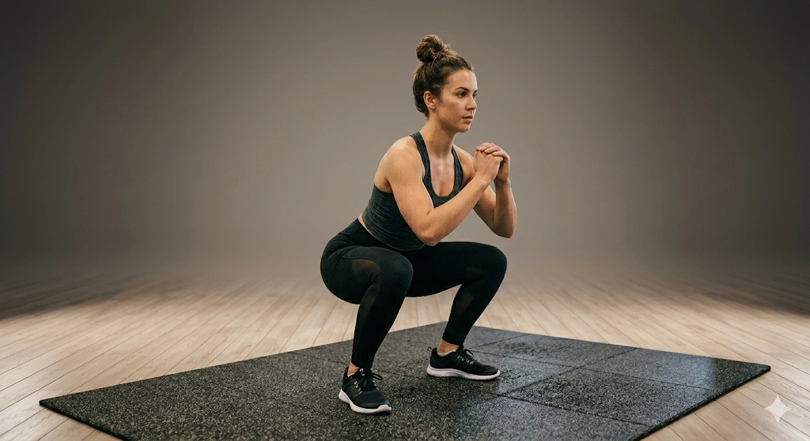
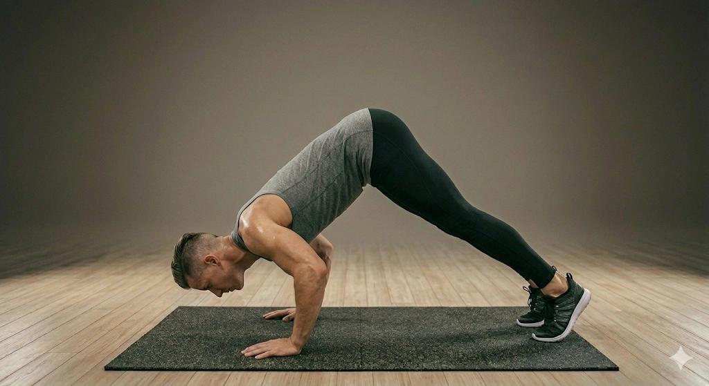
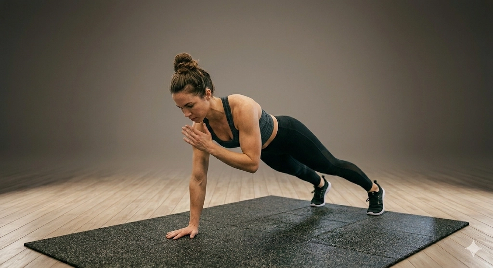

# Exercise Performance Protocol per Exercise

**Document Version:** 1.0.8
**Last Updated:** 2026-05-09
**Korean Sync:** [docs/practical_protocols/exercise_performance_protocol.md](../../docs/practical_protocols/exercise_performance_protocol.md) is the matching Korean document.

This document defines standard performance instructions, participant-facing cues,
and analysis-disrupting performance patterns for the current four target exercises.
Here, "standard performance" means a reproducible acquisition target for monocular
pose analysis, not a clinical correction standard. The common principles, especially
performance failure-point recording, also apply to future exercises added outside
the current four-exercise set.

Shared camera position and height definitions follow [camera_protocol.md](camera_protocol.md).
The example images in this document are representative photos for participant-facing
movement understanding. For exercise-specific biomechanical rationale, compensation
patterns, and scoring-candidate/control-factor distinctions, see the detailed
documents under `docs_eng/clinical/exercises/`.

---

## 1. Common Principles

1. Each set should be filmed in one take when possible, without a separate static
   waiting period after recording starts.
2. For pilot pipeline-validation data, the default acquisition unit is one exercise
   per day, 3 sets per exercise, and 10 repetitions per set. Store each set as a
   separate recording when possible.
3. Rest for about 2-3 minutes between sets, or until breathing has returned close
   to baseline. If two or more exercise types must be filmed on the same day, rest
   for at least 15-20 minutes between exercise types.
4. Wear exercise clothing that allows the main joints to be detected. Very loose
   shirts or wide pants should be avoided because they can hide knee, hip, shoulder,
   or trunk landmarks.
5. Film in an independent space without mirror reflections or other people entering
   the frame, so the pose detector does not confuse the target participant with
   another body or reflected body.
6. If the posture deteriorates near the end of a set, do not artificially perform
   cleaner-looking repetitions for the camera. Continue naturally only within a
   pain-free range, and stop immediately if pain or injury risk appears.
7. The target is 10 repetitions. If the participant cannot complete 10 repetitions,
   record the maximum clean repetitions before the posture fully breaks down, and
   store the actual count in annotation or recording metadata.
8. Every exercise should support performance failure-point recording. The performance
   failure point is the first rep/frame, or the recording endpoint, where the participant
   can no longer maintain the core requirement of that exercise consistently: baseline
   posture, ROM, rhythm, base of support, or left-right sequence. This marker is not
   used to diagnose strength or fatigue; it is an acquisition/annotation marker for
   actual repetition count and interpretation-confidence warnings.
9. When arm motion is not the target of analysis, the hands should be fixed so arm
   swing does not contaminate the intended joint trajectory.
10. The "analysis-disrupting performance patterns" below are not immediate recording
   invalidation rules. When observed, record them in the recording or annotation
   note so they can be reviewed during result interpretation.
11. After recording, analysis-disrupting patterns are interpreted along two paths.
   Patterns that can be identified reproducibly from joint-point time series remain
   candidates for movement-quality degradation or compensatory-movement scoring.
   Patterns that cannot be separated reliably from pose data are not scored; they
   remain acquisition-control factors or interpretation-limitation factors.
12. Detectability can vary for the same pattern depending on camera view, landmark
   visibility, body shape, clothing, or changes in the base of support. Therefore,
   analysis-disrupting patterns should not be used first as automatic exclusion
   rules; record the observation basis and data-quality context together.

---

## 2. Per-Exercise Protocols

### 2-1. Squat



*Figure 2-1. Squat example image for participant-facing movement understanding.*

**Camera Setup**

```text
Zone: Z2 / Z8
Height: H2
```

Place the camera at a front-oblique position, either `Z2` or `Z8`, relative to
the reference mat. Set the lens around pelvis or navel height, approximately
80-110 cm.

**Measurement Rationale**

This setup supports simultaneous observation of frontal-plane knee tracking and
hip-flexion depth.

**Detailed Rationale**

See [Squat Clinical Rationale](../clinical/exercises/squat.md).

**Participant Cue**

1. Stand with feet about shoulder-width apart. Cross both hands over the chest or
   hold them lightly in front of the body so arm swing is not used.
2. Sit the hips back as if sitting into a chair, descend until the thighs are nearly
   parallel to the floor, and stand back up.
3. Perform 10 continuous repetitions without resting.

**Analysis-Disrupting Patterns**

- Large arm swing that assists the ascent
- Repeated heel lift or large foot-position changes across repetitions
- Knees moving excessively inward or outward relative to the foot direction
- Depth varying so much that ROM landmarks become unstable
- Excessive trunk folding that makes hip flexion and trunk flexion hard to separate

### 2-2. Lunge


*Figure 2-2. Lunge example image for participant-facing movement understanding.*

**Camera Setup**

```text
Zone: Z3 / Z7
Height: H2
```

Place the camera at a side-view position, either `Z3` or `Z7`, relative to the
reference mat. Set the lens around pelvis height, approximately 80-110 cm.

**Measurement Rationale**

This setup supports observation of anterior knee travel, sagittal trunk alignment,
and the relative motion of the front and rear limbs.

**Detailed Rationale**

See [Lunge Clinical Rationale](../clinical/exercises/lunge.md).

**Participant Cue**

1. Stand with feet about pelvis-width apart, then step one foot comfortably forward.
   Place both hands on the pelvis or waist so arm swing is not used.
2. Keep the trunk upright, descend vertically until both knees approach about
   90 degrees, and return to the starting height.
3. Perform 5 continuous repetitions with the same front foot. Then switch feet
   without turning around and perform 5 continuous repetitions with the opposite
   front foot, for 10 total repetitions.

**Analysis-Disrupting Patterns**

- Step length changing substantially across repetitions
- Arm swing or large trunk extension used to assist the ascent
- Excessive trunk flexion that makes anterior knee travel and trunk alignment hard
  to separate
- Turning the body or changing the camera-facing side during the side switch
- Repeatedly unstable front-foot or rear-foot contact

### 2-3. Pike Push-up



*Figure 2-3. Pike push-up example image for participant-facing movement understanding.*

**Camera Setup**

```text
Zone: Z3 / Z7
Height: H1
```

Place the camera at a side-view position, either `Z3` or `Z7`, relative to the
reference mat. Keep the camera low, approximately 0-30 cm above the floor.

**Measurement Rationale**

This setup supports observation of the inverted-V posture and the sagittal-plane
trajectory of the head, shoulder, and elbow.

**Detailed Rationale**

See [Pike Push-up Clinical Rationale](../clinical/exercises/pike_pushup.md).

**Participant Cue**

1. Lift the hips high so the body forms an inverted V.
2. Lower the crown of the head toward the floor between the hands, then press back
   up using the shoulders.
3. The target is 10 repetitions. If 10 repetitions are too difficult, stop according
   to the common performance failure-point rule without forcing the movement, and
   keep the same 3-set acquisition structure when possible.

**Analysis-Disrupting Patterns**

- Hips dropping so the movement becomes closer to a regular push-up
- Head moving forward beyond the hands rather than descending between them
- Excessive elbow flare that destabilizes the shoulder and elbow trajectory
- Descent depth that is too shallow or highly inconsistent
- Large hand or foot repositioning during the set

### 2-4. Plank Shoulder Tap



*Figure 2-4. Plank shoulder tap example image for participant-facing movement understanding.*

**Camera Setup**

```text
Zone: Z2 / Z8
Height: H1
```

Place the camera at a front-oblique position, either `Z2` or `Z8`, relative to
the reference mat. Keep the camera low, approximately 0-30 cm above the floor.

**Measurement Rationale**

This setup supports observation of pelvic rotation, weight shift, and lateral sway
while one hand taps the opposite shoulder.

**Detailed Rationale**

See [Plank Shoulder Tap Clinical Rationale](../clinical/exercises/plank_shoulder_tap.md).

**Participant Cue**

1. Start in a high plank or push-up-ready position, with the core and hips braced.
2. Resist trunk and pelvis motion while lifting one hand to lightly tap the opposite
   shoulder.
3. Count one left tap plus one right tap as one protocol cycle. Perform 10 total
   protocol cycles.

**Analysis-Disrupting Patterns**

- Excessive pelvic rotation or lateral shift during the tap
- Hips repeatedly lifting too high or dropping too low
- Hand or foot repositioning that changes the base of support during the set
- Missing the left-right order or repeating only one side
- Lifting the hand without actually tapping the opposite shoulder
